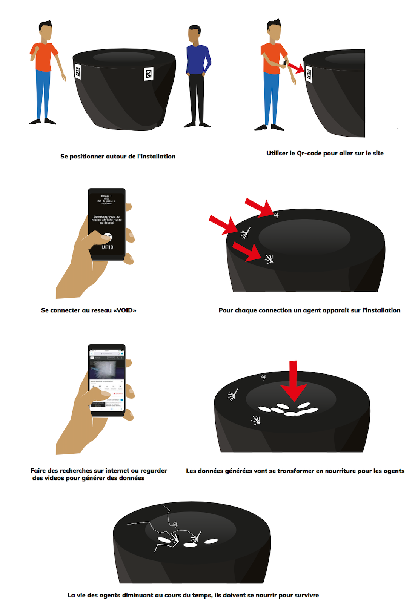

# workshop_code_creatif_1819
This repo holds the code and documentation for the creative coding workshop @lecolededesign. Production were made by students in 2nd year of interaction design using process. The **code** is available [here](https://github.com/AtelierNum/workshop_code_creatif_1819)

## Void 

Réalisé par : **Raphaël Perraud** - **Eliott Chevalier** - **Robin Exbrayat** - **Théo Geiller**

Void est une installation interactive réalisé avec processing. Cette installation représente le flux des données internet sur un réseau internet. L'utilisateur est invité à se connecter sur un hot-spot wifi et à visiter des pages web sélectionnées. Les émissions et récéptions de requêtes sont représentées en vidéo-mapping sur un "table" circulaire comportant un trou au centre. Les packets de données apparaissent au centre de l'installation et sont instantanément dévorés par des agents vivant sur le pourtour de l'univers digital symbolisé par cette table.

Une vidéo de présentation est disponnible [ici](https://youtu.be/PhswR3uoNPM)

[Cahier de recherche](Void/Journal_de_bord.pdf)

## La pluie de minuit 

## Mouvance

## Abymes

## Floody

## Splash light

## Silhéa

## Psyché 70's

TODO

* Extraire textes courts

* liens vers vidéos youtube 
* liens vers les pdf
* liens vers les cartels

+> push !!
